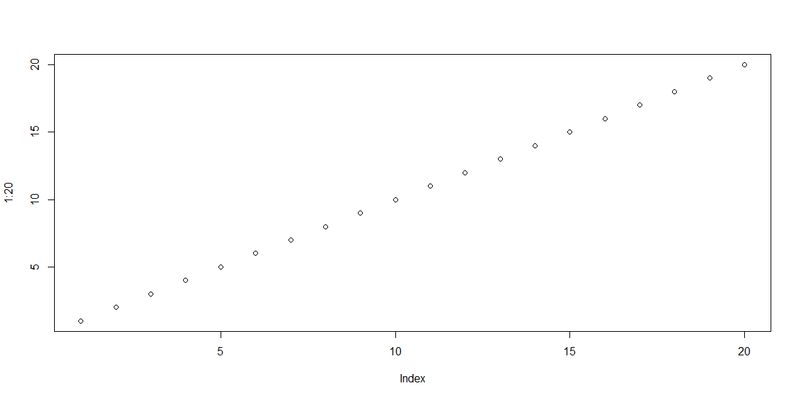

### Coronavirus Map: Tracking the Global Outbreak
https://www.nytimes.com/interactive/2020/world/coronavirus-maps.html

This page from The New York Times has several graphs and maps that show the amount of cases of coronavirus per country and how many cases each country reports per day. I like that the interactive map combines a graph with tables. If you put your mouse of the circles on the map, a table pops up that tells you more data. I think the graph makes it easy to see which countries have been hit hard by the virus, which I believe is the main message. The downside about the map is that area is used to compare the circles so it's not necessarily easy to see right away how some of the circles not labeled compare.

### Are Democrats Winning The Race For Congress?
https://projects.fivethirtyeight.com/congress-generic-ballot-polls/?ex_cid=rrpromo

This graph from FiveThirtyEight shows "an estimate of the congressional generic ballot, based on polls that ask people which party they would support." They use position along a common scale to show the average support for both democrats and republicans as a trend line over the last year. Whats nice about this graph is that they show the margin of error of their estimate. It's also interactive so you can see the specific numbers from any given day. Points are placed within the graph to represent specific polls but maybe the line with margin of error is sufficient since there is a table below anyway.

### Homelessness and poverty in rich countries
https://ourworldindata.org/homelessness-and-poverty-in-rich-countries

This graph shows the percent of the populations of five wealthy countries that have ever been homeless. This graph is nice because it doesn't distract from the data. The grid lines are subtle. It is easy to see the comparison between countries because of the order. It seems like with the amount of data in this graph a simple table may have been sufficient to communicate the message.

### Not all deaths are equal: How many deaths make a natural disaster newsworthy?
https://ourworldindata.org/how-many-deaths-make-a-natural-disaster-newsworthy

This article uses to graphs that are bar charts using length to show what percentage of total distaster news coverage a type of disaster gets and how many deaths given the type of disaster would make media coverage equally likely. The bars in the graph are ordered so it is easy to see the comparison of disasters. The message that some "spectacular" disasters get more coverage is apparent because of the comparisons made. It is not exactly clear what the percentages in the first graph represent and length is used which is not always the best tool to communicate the data.

```r
plot(1:20)
```

<!-- -->

