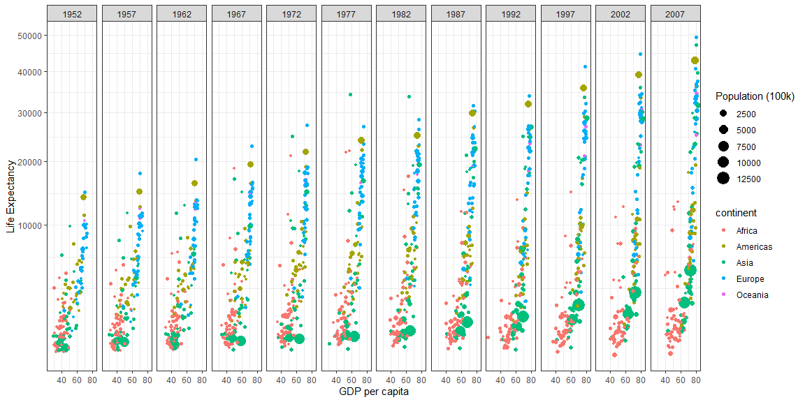

```r
# Use this R-Chunk to import all your datasets!
dataset = gapminder
```

## Background

I learned how to better use the groupby() and summarise() functions together as well as mutate(). I also learned how to make plot axis labels and how to scale the axis. The thing that I was stuck on the longest was how to group the countries without using color or shap for the send plot so I learned that this can be done with group in the mapping.

## Images


```r
# Use this R-Chunk to clean & wrangle your data!
datanokuwait <- filter(dataset, country != "Kuwait")
datanokuwait <- mutate(datanokuwait, 'Population (100k)' = pop / 100000)
datameansum <- datanokuwait %>% 
  group_by(continent,year) %>% 
  summarise(`Population (100k)` = sum(`Population (100k)`),GDP = weighted.mean(gdpPercap,pop))
```


```r
# Use this R-Chunk to plot & visualize your data!
ggplot(data = datanokuwait) + 
  geom_point(mapping = aes(x = lifeExp, y = gdpPercap, color = continent, size = `Population (100k)`)) + 
  facet_wrap(~ year, nrow = 1) +
  theme_bw() +
  scale_y_continuous(trans = "sqrt") +
  xlab('GDP per capita') +
  ylab('Life Expectancy')
```

<!-- -->

```r
ggsave("plot1.png",width = 15, units = "in")
```


```r
# Use this R-Chunk to plot & visualize your data!
ggplot() + 
  geom_path(data = datanokuwait, mapping = aes(x = year, y = gdpPercap, group = country, color = continent)) +
  geom_path(data = datameansum, mapping = aes(x = year, y = GDP)) +
  geom_point(data = datanokuwait, mapping = aes(x = year, y = gdpPercap, color = continent, size = `Population (100k)`)) +
  geom_point(data = datameansum, mapping = aes(x = year, y = GDP, size = `Population (100k)`)) +
  facet_wrap(~ continent, nrow = 1) +
  theme_bw() +
  xlab('Year') +
  ylab('GDP per capita')
```

<!-- -->

```r
ggsave("plot2.png",width = 15, units = "in")
```

