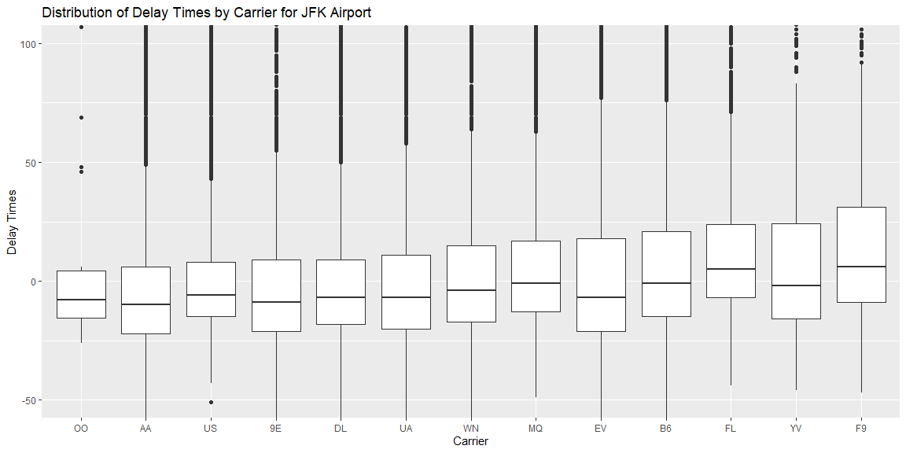
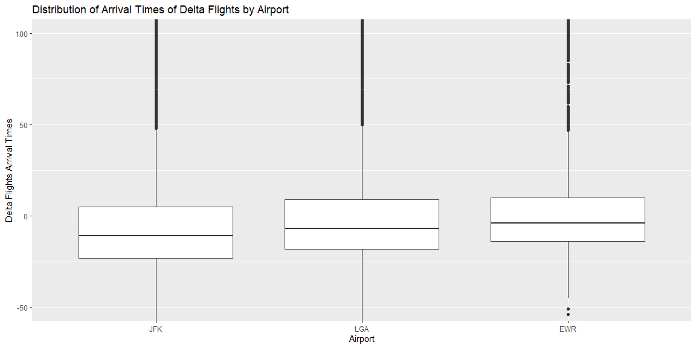

## Data Wrangling


```r
# Use this R-Chunk to clean & wrangle your data!
jfk <- filter(flights, origin == "JFK")
lga <- filter(flights, origin == "LGA")
ewr <- filter(flights, origin == "EWR")
delta <- filter(flights, carrier == "DL")
deltasum <- delta %>% 
  group_by(origin) %>% 
  summarise(ave = mean(arr_delay))

xj <- jfk$carrier
yj <- jfk$arr_delay
xjord <- reorder(xj,yj, FUN = quantile,prob = 0.75, na.rm = TRUE)

xl <- lga$carrier
yl <- lga$arr_delay
xlord <- reorder(xl,yl, FUN = quantile,prob = 0.75, na.rm = TRUE)

xe <- ewr$carrier
ye <- ewr$arr_delay
xeord <- reorder(xe,ye, FUN = quantile,prob = 0.75, na.rm = TRUE)

xd <- delta$origin
yd <- delta$arr_delay
xdord <- reorder(xd,yd, FUN = median, na.rm = TRUE)

djfk <- filter(jfk, carrier == "DL")
dlga <- filter(lga, carrier == "DL")
dewr <- filter(ewr, carrier == "DL")

pldjfk <- NROW(subset(djfk,arr_delay > 0)) / NROW(djfk)
pldlga <- NROW(subset(dlga,arr_delay > 0)) / NROW(dlga)
pldewr <- NROW(subset(dewr,arr_delay > 0)) / NROW(dewr)

percent_late = c(pldewr,pldjfk,pldlga)
deltasum$percent_late <- percent_late
```

## If I am leaving before noon, which two airlines do you recommend at each airport (JFK, LGA, EWR) that will have the lowest delay time at the 75th percentile?

When using JFK the airlines with the lowest delay time at the 75th percentile are HA and DL. When using EWR the airlines with the lowest delay time at the 75th percentile are AS and 9E. When using JFK the airlines with the lowest delay time at the 75th percentile are OO and AA.


```r
# Use this R-Chunk to plot & visualize your data!
jfk %>% ggplot(aes(x = xjord, y = arr_delay)) +
  geom_boxplot() +
  coord_cartesian(ylim = c(-50,100)) + 
  labs(title = "Distribution of Delay Times by Carrier for JFK Airport",
       y = "Delay Times",
       x = "Carrier")
```

<!-- -->


```r
ewr %>% ggplot(aes(x = xeord, y = arr_delay)) +
  geom_boxplot() +
  coord_cartesian(ylim = c(-50,100)) + 
  labs(title = "Distribution of Delay Times by Carrier for EWR Airport",
       y = "Delay Times",
       x = "Carrier")
```

<!-- -->


```r
lga %>% ggplot(aes(x = xlord, y = arr_delay)) +
  geom_boxplot() +
  coord_cartesian(ylim = c(-50,100)) + 
  labs(title = "Distribution of Delay Times by Carrier for JFK Airport",
       y = "Delay Times",
       x = "Carrier")
```

<!-- -->

## Which origin airport is best to minimize my chances of a late arrival when I am using Delta Airlines?

By comparing where 0 arrival delay falls in the distributions we can see that JFK has the lowest percentage of Delta flights that arrive late.


```r
deltasum %>% ggplot(aes(x = fct_reorder(origin,percent_late),y = percent_late)) +
  geom_col() +
  labs(title = "Percent of Late Arrivals of Delta Flights by Airport",
       x = "Airport",
       y = "Percent of Delta Flights that Arrive Late")
```

<!-- -->

```r
delta %>% ggplot(aes(x = xdord, y = arr_delay)) +
  geom_boxplot() +
  coord_cartesian(ylim = c(-50,100)) + 
  labs(title = "Distribution of Arrival Times of Delta Flights by Airport",
       x = "Airport",
       y = "Delta Flights Arrival Times")
```

<!-- -->

